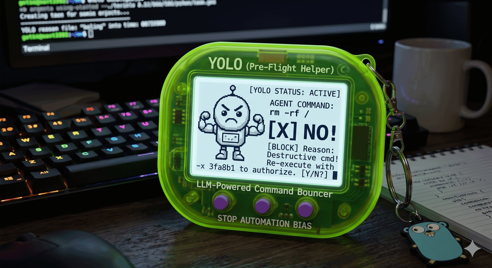

# YOLO (Pre-flight Command Checker)




`yolo` is a lightweight Go tool for Bash and Zsh that routes each shell command through an
OpenAI-compatible LLM endpoint for a pre-flight approve/deny check, replacing the need for static
allow-list and regex-based command approval lists in coding agents.

`yolo` is designed to combat operator fatigue and automation bias: when an AI agent generates a
high volume of mostly-harmless commands, a human reviewing every one stops reading carefully and
rubber-stamps them.

`yolo` auto-approves and executes routine commands, but blocks the significant ones such as `rm -rf` and `git push --force` with a prompt that triggers the coding agent to elicit human approval.

By using an LLM-based reasoning model `yolo` can understand the implications of deeply chained and
context-dependent commands needed for infrastructure automation (jump hosts, `ssh` tunnels,
`aws ssm` sessions, `kubectl exec`, nested `sh -c`).

**Not a security tool:** `yolo` is a convenience filter, not a security boundary. It relies on
best-effort LLM judgment, trusts the caller to cooperate, and uses a keyless, easily-reproduced
bypass code by design. Do not rely on it to contain untrusted code or stop a malicious actor. Use
sandboxing, least-privilege accounts, and OS-level controls for those needs.

---

## Quick Start

1. Clone this project.
2. Run the installer for your provider. Each builds the binary, installs the shell hooks to
   `~/.yolo/`, and prints the config to add to your environment:
   ```bash
   ./install-cborg.sh    # LBNL CBORG users (built-in default endpoint)
   ./install-openai.sh   # OpenAI users
   ```
Agents route commands through `yolo -c '<command>'`, so no shell profile changes are required.

---

## Integrating with a Coding Agent

To route an agent's commands through `yolo`, tell it to call `yolo -c '<command>'` instead of
running commands directly. [`INSTALL-AGENTS.md`](INSTALL-AGENTS.md) contains a ready-to-paste
instruction block.

1. Copy the full contents of [`INSTALL-AGENTS.md`](INSTALL-AGENTS.md) into your agent global instructions and/or project instructions.

 - **OpenAI Codex / generic agents**: project `AGENTS.md`
 - **Claude Code**: project `CLAUDE.md` (or `~/.claude/CLAUDE.md` for all projects)
 - **Cursor**: a rule under `.cursor/rules/`
 - **Other agents**: that agent's global or project-level rules insertion point

Once integrated, `yolo` can be the sole auto-approved command -- you are prompted only for the
commands the policy flags. For all projects, paste into your global agent rules file instead.

---

## CLI Flags

```
yolo [flags] [command...]

  -c <expr>     Check and execute a command expression. Preferred for all agent use and
                compound commands (pipes, chains, redirects, heredocs).
  -x <hash>     6-char hex bypass code to authorize a previously blocked command.
  -s <file>     Scan a skill/agent definition file for embedded malicious instructions.
  --paranoid    Allow only strictly read-only commands. Shorthand: -p
  --dry-run     Check without executing; print the verdict and exit 0. Shorthand: -t
  -d <secs>     Delay N seconds before submitting the command for safety check. Supports
                fractions (e.g. 0.5). Skipped on -x bypass. Shorthand for --delay.
  --delay <N>   Same as -d.
```

---

## Configuration

Set these in your shell profile or session:

| Variable | Description |
|---|---|
| `YOLO_BASE_URL` | OpenAI-compatible endpoint base URL. Falls back to `CBORG_BASE_URL`, then `https://api.cborg.lbl.gov`. |
| `YOLO_MODEL` | Model for command safety checks. Falls back to `CBORG_DEFAULT_MODEL`, then `cborg-safeguard-high`. |
| `YOLO_SKILL_MODEL` | Model for skill/agent file scans (`-s`). Falls back to `YOLO_MODEL`, then the above chain. |
| `YOLO_API_KEY` | Bearer key for authorization. Falls back to `CBORG_API_KEY`. |
| `YOLO_INTERACTIVE` | `1` to use interactive TTY prompts (`y/N`) instead of hash bypass codes. |
| `YOLO_PARANOID` | `1` to enable paranoid mode (same as `--paranoid`). |
| `YOLO_ENVS` | Comma-separated env var **names** that activate the hook. Defaults to `YOLO_TEST,ROO_ACTIVE,ZOO_ACTIVE,CLAUDE_CODE,OPENCODE`. |
| `YOLO_DEBUG` | `1` to print debug output to stderr. |
| `YOLO_SLEEP` | Seconds to delay before the safety check. Supports fractions (e.g. `0.5`). Non-numeric or negative values are an error (fail closed). Overridden by `--delay`/`-d`. Skipped on `-x` bypass. |

---

## Command Modes & Examples

### Exec Mode Examples (`-c`)

`yolo -c` checks the command and, if approved, runs it directly in the current shell. This is the
required form for agents and any compound expression. Do not run the command again afterward.

```bash
yolo -c 'rm -rf ./dist'
yolo -c 'git add . && git commit -m "fix: update config"'
yolo -c 'cat files.txt | xargs rm -f'

# Multi-line commands work directly; pass them as a single quoted string
yolo -c 'find /tmp -name "*.log" -mtime +7 | xargs rm -f'
```

### Bypass Codes (`-x`)

A blocked command exits `1` and prints a SHA-256-derived 6-char hash:

```
[YOLO BLOCKED] Reason: <explanation>
ERROR: ...re-execute using: yolo -x 3fa8b1 -c '<cmd>'
```

After explicit user approval, re-run with `-x`:

```bash
yolo -x 3fa8b1 -c 'rm -rf ./dist'
```

The code is derived from the exact command string, so it authorizes only what was reviewed. This
is a drift check, not a security guarantee -- the code is keyless and reproducible. If the command
changes, the old code no longer matches and `yolo` prints a new one, prompting fresh approval.

### Paranoid Mode (`--paranoid` / `-p`)

Restricts execution to verified read-only operations.

- A local fast-path allows read-only commands (`ls`, `pwd`, `cd`, `cat`, `grep`, `find`, `echo`,
  `head`, `tail`, `less`, `more`, `du`, `df`, `free`, `ps`, and read-only git subcommands:
  `status`, `diff`, `log`, `show`, `branch`) with no LLM call.
- Commands with shell metacharacters (`>`, `<`, `|`, `;`, `&`, `$`, `` ` ``) are forwarded to the
  LLM under the paranoid policy.
- Everything else is blocked.

### Skill/Agent File Scanning (`-s`)

Scans a file for embedded malicious instructions before an agent trusts or loads it, using a
deep-analysis prompt for supply-chain and tool-poisoning attacks. Exit `0` = safe, `1` = threat
or scan error. Use `YOLO_SKILL_MODEL` to scan with a different model.

```bash
yolo -s AGENTS.md
```

Detects: prompt injection / jailbreak, data exfiltration, social engineering, cyberattack
facilitation, supply-chain / tool poisoning, and obfuscation / evasion.

### Dry-Run Mode (`--dry-run` / `-t`)

Performs the safety check without executing. Prints the verdict to stderr and exits `0`
regardless of the result.

```bash
yolo --dry-run -c 'rm -rf /'
# stderr: [YOLO DRY-RUN] ALLOW: rm -rf /   (or BLOCK)
# exit: 0
```

---

## Interactive Terminal Activation (Experimental)

> **Experimental feature -- not recommended.** The interactive shell hooks are experimental and
> intended only for manual terminal testing. Agents route commands through `yolo -c '<command>'`
> and do not need this. Most users should skip it.

Installed by sourcing the shell integration (zsh or bash) from your shell profile:

```bash
# ~/.bashrc or ~/.bash_profile
source "$HOME/.yolo/shell/yolo-setup.bash"

# ~/.zshrc
source "$HOME/.yolo/shell/yolo-setup.zsh"
```

### Activation

The hook runs only when at least one variable named in `YOLO_ENVS` is non-empty; otherwise
commands pass through with no overhead. Defaults: `YOLO_TEST`, `ROO_ACTIVE`, `ZOO_ACTIVE`,
`CLAUDE_CODE`, `OPENCODE`. To activate for a custom context:

```bash
export YOLO_ENVS=MY_AGENT_VAR,ANOTHER_AGENT_VAR
```

Interactively typed commands are captured via native hooks (`DEBUG` traps in Bash, a custom
`accept-line` widget in Zsh).

`yolo` mode can be activated manually:

```bash
yolo_activate    # enable YOLO_INTERACTIVE=1, prefix prompt with [yolo]
yolo_deactivate  # disable it and restore the prompt
```

Use with YOLO_INTERACTIVE=1 to elicit y/N approval from /dev/tty. This mode is primarily for testing but also works with the ZooCode VSCode Extension when terminal integration is disabled (VSCode terminal injection).

